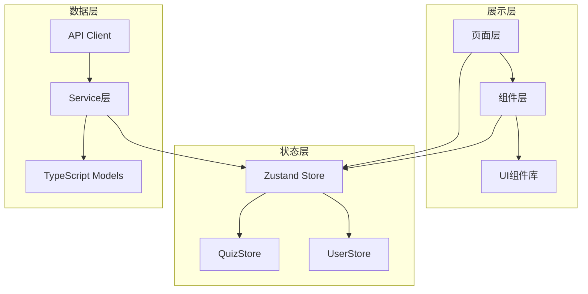
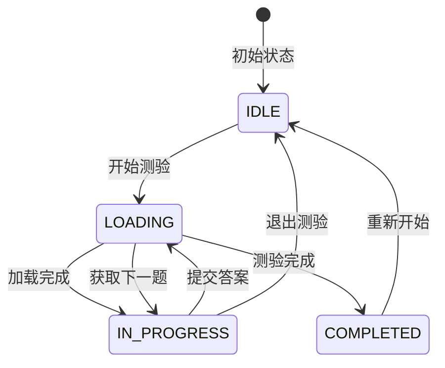

# 前端设计文档 - 智能测验系统

## 1. 技术栈

| 类型 | 技术选型 | 版本 |
|:---|:---|:---|
| **框架** | React 18 | ^18.3.1 |
| **语言** | TypeScript | ^5.6.2 |
| **构建工具** | Vite | ^5.4.2 |
| **路由** | React Router | ^6.28.0 |
| **状态管理** | Zustand | ^5.0.2 |
| **HTTP 客户端** | 自动生成（openapi-typescript-codegen） | - |
| **UI 组件库** | Ant Design | ^5.22.5 |
| **样式方案** | Tailwind CSS | ^3.4.16 |
| **图标** | Iconify React | ^5.0.2 |

---

## 2. 系统架构



---

## 3. 路由设计

| 路径 | 组件 | 说明 | 权限 |
|:---|:---|:---|:---|
| `/quiz` | QuizPage | 测验主页面 | 需登录 |
| `/quiz/history` | QuizHistoryPage | 测验历史 | 需登录 |
| `/quiz/analysis` | QuizAnalysisPage | 学习分析 | 需登录 |

---

## 4. 页面设计

### 4.1 测验主页面 (`QuizPage`)

**页面状态流转：**



**UI 状态：**

| 状态 | 展示内容 |
|:---|:---|
| `IDLE` | QuizSetup 组件（文档选择） |
| `LOADING` | Loading 动画 |
| `IN_PROGRESS` | QuestionRenderer 组件 + 答题控制栏 |
| `COMPLETED` | 完成页面 + 重新开始按钮 |
| `ERROR` | 错误提示 + 返回设置 |

### 4.2 测验历史页面 (`QuizHistoryPage`)

**展示内容：**
- 测验会话列表（支持筛选：全部/进行中/已完成）
- 每个会话卡片包含：
  - 测验模式、开始/结束时间
  - 得分、题目数量、正确率
  - 操作按钮（查看详情/继续测验/删除）

**API 调用：**
- `GET /api/v1/quiz/session/list` - 获取测验列表
- `DELETE /api/v1/quiz/session/{id}` - 删除测验

### 4.3 学习分析页面 (`QuizAnalysisPage`)

**展示内容：**
- 三维认知模型可视化（雷达图）
- 知识缺口列表（按严重程度排序）
- 学习进度趋势图（折线图）
- 知识点掌握度矩阵

**API 调用：**
- `GET /api/v1/quiz/analysis/user/{userId}` - 获取用户认知状态
- `GET /api/v1/quiz/analysis/user/{userId}/gaps` - 获取知识缺口
- `GET /api/v1/quiz/analysis/session/{id}/report` - 获取会话报告

---

## 5. 状态管理（Zustand）

### 5.1 QuizStore

```typescript
interface QuizState {
  // 会话状态
  sessionId: string | null;
  sessionStatus: 'IDLE' | 'LOADING' | 'IN_PROGRESS' | 'COMPLETED' | 'ERROR';
  
  // 题目数据
  currentQuestion: QuestionVO | null;
  questions: QuestionVO[];
  
  // 答案缓存
  answers: Record<string, any>;
  
  // Actions
  startNewSession: (documentIds: number[]) => Promise<void>;
  submitAnswer: (answer: any) => Promise<void>;
  fetchNextQuestion: () => Promise<void>;
  setAnswer: (questionId: string, answer: any) => void;
  resetQuiz: () => void;
}
```

**持久化策略：**
- 使用 `zustand/middleware` 的 `persist` 中间件
- 存储位置：localStorage
- 存储键：`quiz-storage`

---

## 6. API 接口集成

### 6.1 测验会话相关

| 功能 | API | 调用时机 | Store Action |
|:---|:---|:---|:---|
| 创建会话 | `POST /api/v1/quiz/session` | 开始测验 | `startNewSession` |
| 提交答案 | `POST /api/v1/quiz/session/{id}/answer` | 点击"下一题" | `submitAnswer` |
| 获取下一题 | `GET /api/v1/quiz/session/{id}/next` | 提交答案后 | `fetchNextQuestion` |
| 查询会话状态 | `GET /api/v1/quiz/session/{id}/status` | 下一题不存在时 | `fetchNextQuestion` |
| 查询会话详情 | `GET /api/v1/quiz/session/{id}` | 查看历史 | - |
| 更新会话 | `PUT /api/v1/quiz/session/{id}` | 暂停/恢复/放弃 | - |
| 删除会话 | `DELETE /api/v1/quiz/session/{id}` | 删除历史 | - |
| 会话列表 | `GET /api/v1/quiz/session/list` | 打开历史页 | - |

### 6.2 分析相关

| 功能 | API | 调用时机 |
|:---|:---|:---|
| 用户认知状态 | `GET /api/v1/quiz/analysis/user/{userId}` | 打开分析页 |
| 会话报告 | `GET /api/v1/quiz/analysis/session/{id}/report` | 查看测验详情 |
| 知识缺口列表 | `GET /api/v1/quiz/analysis/user/{userId}/gaps` | 打开分析页 |

---

## 7. 组件设计

### 7.1 题目渲染组件（QuestionRenderer）

**支持的题型（与后端一致）：**

| 题型 | 枚举值 | 组件 | 说明 |
|:---|:---|:---|:---|
| 单选题 | `SINGLE_CHOICE` | SingleChoiceView | 选项列表，单选 |
| 多选题 | `MULTIPLE_SELECT` | MultipleSelectView | 选项列表，多选 |
| 判断题 | `TRUE_FALSE` | TrueFalseView | True/False 按钮 |
| 填空题 | `FILL_IN_BLANK` | FillInBlankView | 文本中嵌入输入框 |
| 排序题 | `ORDERING` | OrderingView | 拖拽排序选项 |
| 连线题 | `MATCHING` | MatchingView | 左右配对连线 |
| 简答题 | `SHORT_ANSWER` | ShortAnswerView | 文本域 |
| 解释题 | `EXPLANATION` | ShortAnswerView | 文本域（复用） |
| 代码补全 | `CODE_COMPLETION` | CodeCompletionView | 代码编辑器 |

**组件架构：**

```
QuestionRenderer (路由器)
├── QuestionCard (容器组件)
│   ├── 题目文本
│   ├── 标签（难度/知识点）
│   ├── 进度显示
│   └── 子组件占位
└── [具体题型组件]
    ├── SingleChoiceView
    ├── MultipleSelectView
    ├── TrueFalseView
    ├── FillInBlankView
    ├── OrderingView
    ├── MatchingView
    ├── ShortAnswerView
    └── CodeCompletionView
```

### 7.2 测验设置组件（QuizSetup）

**功能：**
- 文档选择（多选）
- 测验模式选择（简单/中等/困难/自适应）
- 题目数量设置（自适应模式为 0）

**API 调用：**
- `GET /api/v1/documents/list` - 获取可用文档列表
- `POST /api/v1/quiz/session` - 创建测验会话

### 7.3 公共 UI 组件（基于 Neon 设计风格）

| 组件 | 用途 | 特性 |
|:---|:---|:---|
| NeonCard | 卡片容器 | 霓虹边框、毛玻璃效果 |
| NeonButton | 按钮 | 霓虹光晕、渐变背景 |
| QuestionCard | 题目卡片 | 统一题目展示样式 |

---

## 8. UI/UX 设计规范

### 8.1 设计风格

**参考：** neon-quiz-app 模板

**核心特性：**
- 深色模式为主
- 霓虹色彩（紫/蓝/青色渐变）
- 毛玻璃效果（backdrop-blur）
- 平滑动画过渡

### 8.2 色彩系统

| 用途 | Tailwind 类 | 说明 |
|:---|:---|:---|
| 主色 | `text-primary` / `bg-primary` | 霓虹紫 (#A78BFA) |
| 背景 | `bg-background-dark` | 深色背景 (#0F172A) |
| 卡片背景 | `bg-surface-dark` | 半透明卡片 |
| 边框 | `border-surface-border` | 边框色 |
| 文本主色 | `text-text-main` | 白色/浅色 |
| 文本次要 | `text-text-muted` | 灰色 |

### 8.3 动画效果

| 场景 | 类名/效果 |
|:---|:---|
| 题目切换 | `animate-fade-in` |
| 按钮悬停 | `hover:shadow-[0_0_20px_rgba(167,139,250,0.6)]` |
| 加载状态 | `svg-spinners:ring-resize` 图标 |

---

## 9. 目录结构

```
src/
├── api/                          # 自动生成的 API 客户端
│   ├── models/                   # TypeScript 模型
│   │   ├── QuestionVO.ts
│   │   ├── QuizSessionVO.ts
│   │   └── ...
│   └── services/
│       └── Service.ts
├── components/
│   └── quiz/                     # 测验相关组件
│       ├── NeonCard.tsx          # 霓虹卡片
│       ├── NeonButton.tsx        # 霓虹按钮
│       ├── QuestionCard.tsx      # 题目卡片容器
│       ├── QuestionRenderer.tsx  # 题目渲染器
│       ├── QuizSetup.tsx         # 测验设置
│       ├── SingleChoiceView.tsx
│       ├── MultipleSelectView.tsx
│       ├── TrueFalseView.tsx
│       ├── FillInBlankView.tsx
│       ├── OrderingView.tsx
│       ├── MatchingView.tsx
│       ├── ShortAnswerView.tsx
│       └── CodeCompletionView.tsx
├── features/
│   └── quiz/                     # 测验功能模块
│       ├── QuizPage.tsx          # 测验主页
│       ├── QuizHistoryPage.tsx   # 历史页（待实现）
│       └── QuizAnalysisPage.tsx  # 分析页（待实现）
├── store/
│   └── quizStore.ts              # Zustand 状态管理
└── routes/
    └── index.tsx                 # 路由配置
```

---

## 10. 答案序列化规则

| 题型 | 前端数据类型 | 后端接收格式 | 序列化方式 |
|:---|:---|:---|:---|
| SINGLE_CHOICE | `string` | `string` | 直接传递 |
| MULTIPLE_SELECT | `string[]` | `string` | `JSON.stringify(array)` |
| TRUE_FALSE | `"TRUE"` / `"FALSE"` | `string` | 直接传递 |
| FILL_IN_BLANK | `string` | `string` | 直接传递 |
| ORDERING | `string[]` | `string` | `JSON.stringify(array)` |
| MATCHING | `Record<string, string>` | `string` | `JSON.stringify(object)` |
| SHORT_ANSWER | `string` | `string` | 直接传递 |
| EXPLANATION | `string` | `string` | 直接传递 |
| CODE_COMPLETION | `string` | `string` | 直接传递 |

**实现位置：** `quizStore.ts` 中的 `submitAnswer` 方法

```typescript
const finalAnswer = typeof answer === 'string' ? answer : JSON.stringify(answer);
```

---

## 11. 响应式设计

| 断点 | 屏幕宽度 | 适配策略 |
|:---|:---|:---|
| 手机 | < 768px | 单列布局，底部固定按钮 |
| 平板 | 768px - 1024px | 居中卡片，宽度限制 |
| 桌面 | > 1024px | 最大宽度 5xl，居中展示 |

---

## 12. 错误处理

| 场景 | 处理方式 |
|:---|:---|
| API 调用失败 | 显示 Ant Design Message 提示 |
| 会话过期 | 自动重置状态，返回 IDLE |
| 网络超时 | 显示重试按钮 |
| 未知题型 | 显示提示文本："不支持的题型" |

---

## 13. 性能优化

| 优化项 | 方案 |
|:---|:---|
| 组件懒加载 | `React.lazy` + `Suspense` |
| 答案本地缓存 | Zustand persist 中间件 |
| 避免重复渲染 | `React.memo` 包装纯展示组件 |
| API 请求合并 | 提交答案后立即获取下一题 |

---

## 14. 开发规范

### 14.1 组件开发规范

- 使用 TypeScript 严格模式
- Props 接口必须明确定义
- 事件处理函数使用 `handle` 前缀
- 样式优先使用 Tailwind CSS

### 14.2 命名规范

| 类型 | 规范 | 示例 |
|:---|:---|:---|
| 组件文件 | PascalCase | `QuestionCard.tsx` |
| 非组件文件 | camelCase | `quizStore.ts` |
| 接口/类型 | PascalCase | `QuestionVO` |
| 函数/变量 | camelCase | `handleAnswer` |

---

## 15. 待实现功能

### Phase 1：核心功能（已完成）
- ✅ 测验会话流程
- ✅ 题目渲染（9种题型）
- ✅ 答案提交与存储
- ✅ 状态管理

### Phase 2：扩展功能（部分完成）
- ✅ 测验历史页面
- ⏳ 学习分析页面
- ✅ 暂停/恢复测验
- ✅ 继续现有测验（从历史页面恢复进行中的测验）
- ⏳ 实时响应时间统计

### Phase 3：优化功能（待实现）
- ⏳ 答题反馈动画
- ⏳ 错题回顾
- ⏳ 知识点详情查看
- ⏳ 深色/浅色模式切换

---

## 16. 与后端对接清单

| 对接项 | 状态 | 说明 |
|:---|:---|:---|
| API Client 生成 | ✅ | 基于 OpenAPI 规范自动生成 |
| 题型枚举一致性 | ✅ | 前后端使用相同枚举值 |
| 答案格式约定 | ✅ | 按序列化规则处理 |
| 会话状态同步 | ✅ | 使用后端返回的 status 字段 |
| 文档 ID 传递 | ✅ | 使用 `number[]` 类型 |
| UUID 主键处理 | ✅ | 后端返回 `string` 类型 UUID |
| submitAnswer 响应处理 | ✅ | 正确检查 hasNextQuestion/quizCompleted 字段 |

---

## 17. 已修复问题

| 问题 | 状态 | 修复说明 |
|:---|:---|:---|
| submitAnswer 后直接调用 /next | ✅ 已修复 | 现在会检查响应中的 `hasNextQuestion`、`nextQuestion`、`quizCompleted` 字段，优先使用响应中的下一题数据 |
| 测验页面跳转链路不清晰 | ✅ 已修复 | 创建 `QuizNav` 统一导航组件，所有测验页面共用标签导航栏，支持返回按钮 |

---

## 18. 公共组件

### QuizNav 导航组件

位置：`src/components/quiz/QuizNav.tsx`

**功能：**
- 统一的测验模块页面顶部导航
- 三个导航标签：开始测验、测验历史、学习分析
- 支持自定义标题和副标题
- 支持返回按钮（子页面使用）
- 支持右侧自定义内容区

**Props：**
| 属性 | 类型 | 默认值 | 说明 |
|:---|:---|:---|:---|
| `title` | string | '智能测验' | 页面标题 |
| `subtitle` | string | '基于 AI 的自适应学习系统' | 页面副标题 |
| `showBackButton` | boolean | false | 是否显示返回按钮 |
| `backPath` | string | '/quiz' | 返回按钮跳转路径 |
| `rightContent` | ReactNode | - | 右侧自定义内容 |