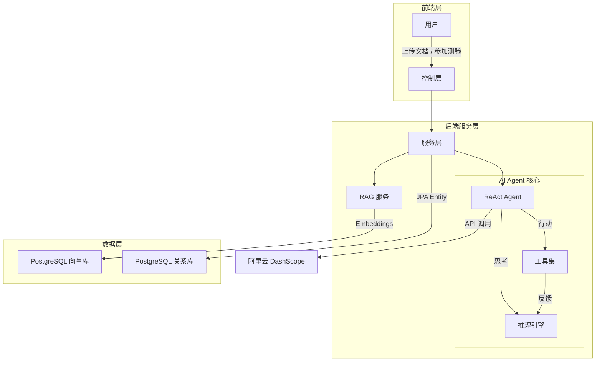
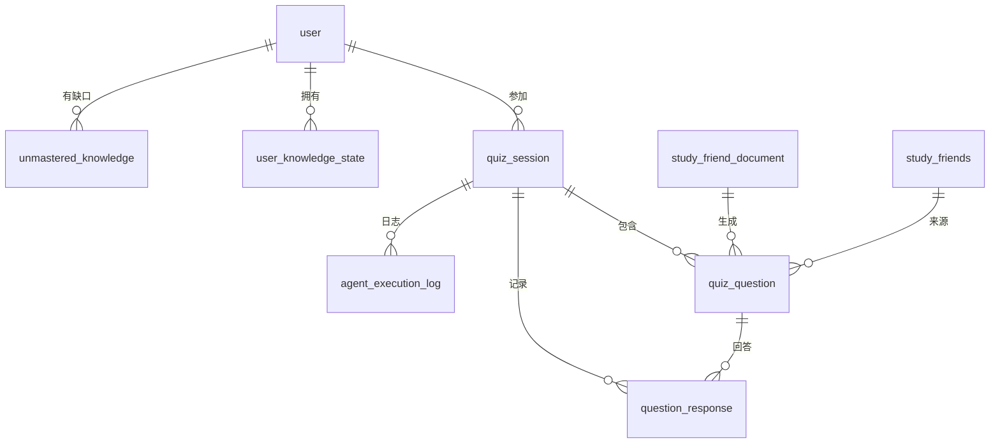
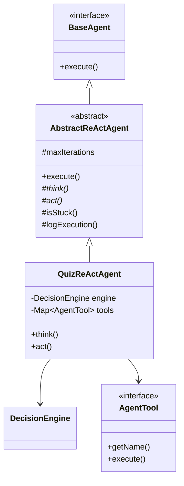

# 后端设计文档 - 智能测验系统

## 1. 技术栈
*   **框架**: Spring Boot 3.4.4
*   **AI 集成**: Spring AI Alibaba (DashScope/通义千问)
*   **ORM**: Spring Data JPA + Hibernate 6.3
*   **JSONB 支持**: hypersistence-utils-hibernate-63
*   **向量库**: PostgreSQL + pgvector
*   **数据库**: PostgreSQL
*   **缓存**: Caffeine (内存缓存)

---

## 2. 系统架构



---

## 3. Agent 设计 (Spring AI 最佳实践)

### 3.1 ReAct 循环

```
Thought → Action → Observation → Thought → ...
```

| 阶段 | 说明 | Spring AI 映射 |
|:---|:---|:---|
| **Thought** | LLM 分析当前状态,制定计划 | ChatClient.prompt() |
| **Action** | 调用外部工具 | @Tool / ToolCallback |
| **Observation** | 接收工具返回结果 | 工具返回值 |

### 3.2 Spring AI 最佳实践

| 实践 | 说明 |
|:---|:---|
| **模块化工具设计** | 每个工具独立,输入输出明确 |
| **结构化输出** | 使用 BeanOutputConverter 解析 LLM 响应 |
| **错误处理** | 工具调用失败时优雅降级 |
| **上下文管理** | 使用 Advisor 管理对话记忆 |
| **可观测性** | 记录 Thought-Action-Observation 日志 |
| **死循环检测** | 限制最大迭代次数,检测重复行动 |

### 3.3 自适应决策

| 场景 | 信号 | Agent 行动 |
|:---|:---|:---|
| **挣扎的学习者** | 高负荷 + 低稳定性 | 缩小边界 / 切换到讲解模式 |
| **大师** | 低负荷 + 高深度 | 扩展边界 / 提高难度 |
| **知识缺口** | 回答错误 | 识别缺口 / 持久化 |

---

## 4. 数据库设计 (Spring Data JPA)

### 4.1 JPA 配置策略

| 环境 | ddl-auto 设置 | 说明 |
|:---|:---|:---|
| **开发环境** | `update` | JPA 自动更新表结构 |
| **生产环境** | `validate` | 仅验证，使用 Flyway 迁移 |

```yaml
# application.yml
spring:
  jpa:
    hibernate:
      ddl-auto: update  # 开发环境
    properties:
      hibernate:
        dialect: org.hibernate.dialect.PostgreSQLDialect
```

### 4.2 表关系图



### 4.3 核心实体 (JPA Entity)

| 实体类 | 表名 | 主键 | 说明 |
|:---|:---|:---|:---|
| `QuizSession` | quiz_session | UUID | 测验会话 |
| `QuizQuestion` | quiz_question | UUID | 测验题目 |
| `QuestionResponse` | question_response | UUID | 题目回答 |
| `UserKnowledgeState` | user_knowledge_state | UUID | 三维认知模型 |
| `UnmasteredKnowledge` | unmastered_knowledge | UUID | 知识缺口 |
| `AgentExecutionLog` | agent_execution_log | UUID | Agent日志 |

### 4.4 JPA 设计规范

#### 通用规范

| 规范项 | 标准 |
|:---|:---|
| **主键** | UUID (由应用层生成) |
| **软删除** | 所有表支持 `is_delete` 字段 |
| **时间字段** | 统一命名 `create_time` / `update_time` |
| **外键约束** | 仅使用 JPA `@ManyToOne`，不使用数据库外键 |
| **审计** | 使用 `@CreatedDate` / `@LastModifiedDate` |

#### JSONB 字段处理

| 字段 | Java 类型 | 说明 |
|:---|:---|:---|
| `document_scope` | `List<Long>` | 结构稳定，使用强类型 |
| `options` | `List<String>` | 结构稳定，使用强类型 |
| `agent_state` | `Map<String, Object>` | 结构多变，使用 Map |
| `input_data / output_data` | `Map<String, Object>` | 结构多变，使用 Map |

```java
// 示例: JSONB 字段映射
@Type(JsonBinaryType.class)
@Column(columnDefinition = "jsonb")
private List<String> options;  // 强类型

@Type(JsonBinaryType.class)
@Column(columnDefinition = "jsonb")
private Map<String, Object> agentState;  // 弱类型，灵活扩展
```

#### 关联关系处理

```java
// 不使用数据库外键，仅使用 JPA 关系映射
@ManyToOne(fetch = FetchType.LAZY)
@JoinColumn(name = "session_id", foreignKey = @ForeignKey(ConstraintMode.NO_CONSTRAINT))
private QuizSession session;

// 避免 N+1 查询
@EntityGraph(attributePaths = {"questions"})
Optional<QuizSession> findByIdWithQuestions(UUID id);
```

### 4.5 现有表 (复用)

| 表名 | 实体类 | 说明 |
|:---|:---|:---|
| `user` | User | 用户信息 (已有 JPA Entity) |
| `tenant` / `tenant_user` | Tenant / TenantUser | 多租户支持 |
| `study_friend_document` | StudyFriendDocument | 用户上传的文档 |
| `study_friends` | - | 向量库 (Spring AI VectorStore) |
| `chat_session` / `chat_message` | - | 对话记录 (JdbcTemplate) |

详见: `sql/quiz_module_tables.sql` (作为参考文档)

---

## 5. API 接口

### 5.1 测验会话 CRUD

```
# 会话管理
POST   /api/v1/quiz/session                    # 创建会话 (开始测验)
GET    /api/v1/quiz/session/{id}               # 查询会话详情
PUT    /api/v1/quiz/session/{id}               # 更新会话 (暂停/恢复)
DELETE /api/v1/quiz/session/{id}               # 删除会话

# 会话列表
GET    /api/v1/quiz/session/list               # 查询用户的测验历史
GET    /api/v1/quiz/session/list?status=xxx    # 按状态筛选

# 答题交互
POST   /api/v1/quiz/session/{id}/answer        # 提交答案
GET    /api/v1/quiz/session/{id}/status        # 会话实时状态
```

### 5.2 分析接口

```
GET    /api/v1/quiz/analysis/user/{userId}           # 用户认知状态
GET    /api/v1/quiz/analysis/session/{id}/report     # 会话报告
GET    /api/v1/quiz/analysis/user/{userId}/gaps      # 用户知识缺口列表
```

### 5.3 接口详情

#### 创建会话 `POST /api/v1/quiz/session`
```json
// Request
{
  "documentIds": [101, 102],     // 可选: 指定文档,为空使用全部
  "quizMode": "ADAPTIVE",        // EASY, MEDIUM, HARD, ADAPTIVE
  "questionCount": 5             // 可选: 题目数量
}

// Response
{
  "sessionId": "550e8400-e29b-41d4-a716-446655440000",
  "status": "IN_PROGRESS",
  "firstQuestion": { ... }
}
```

#### 查询会话列表 `GET /api/v1/quiz/session/list`
```json
// Response
{
  "total": 10,
  "list": [
    {
      "sessionId": "550e8400-e29b-41d4-a716-446655440000",
      "quizMode": "ADAPTIVE",
      "status": "COMPLETED",
      "score": 80,
      "totalQuestions": 5,
      "startedAt": "2026-01-21T20:00:00",
      "completedAt": "2026-01-21T20:15:00"
    }
  ]
}
```

#### 更新会话 `PUT /api/v1/quiz/session/{id}`
```json
// Request
{
  "action": "PAUSE"  // PAUSE, RESUME, ABANDON
}

// Response
{
  "sessionId": "550e8400-e29b-41d4-a716-446655440000",
  "status": "PAUSED"
}
```

---

## 6. 类设计

### 6.1 包结构

```
fun.javierchen.jcaiagentbackend
├── controller/              # REST API (项目统一位置)
│   └── QuizController.java
├── service/                 # 业务逻辑 (项目统一位置)
│   ├── QuizSessionService.java
│   └── UserAnalysisService.java
├── repository/              # 数据访问 (项目统一位置)
│   ├── QuizSessionRepository.java
│   ├── QuizQuestionRepository.java
│   ├── QuestionResponseRepository.java
│   ├── UserKnowledgeStateRepository.java
│   └── UnmasteredKnowledgeRepository.java
├── model/
│   └── entity/              # JPA 实体
│       ├── quiz/
│       │   ├── QuizSession.java
│       │   ├── QuizQuestion.java
│       │   ├── QuestionResponse.java
│       │   ├── UserKnowledgeState.java
│       │   ├── UnmasteredKnowledge.java
│       │   └── AgentExecutionLog.java
│       └── enums/
│           ├── QuizMode.java
│           ├── QuizStatus.java
│           ├── QuestionType.java
│           ├── Difficulty.java
│           └── ConceptMastery.java
└── agent.quiz/              # Agent 专属
    ├── agent/               # ReAct Agent 核心
    │   ├── core/
    │   │   ├── BaseAgent.java              # 接口
    │   │   ├── AbstractReActAgent.java     # 抽象类 (通用逻辑)
    │   │   └── QuizReActAgent.java         # 具体实现
    │   ├── tools/           # 工具集 (Spring AI @Tool)
    │   │   ├── QuizGeneratorTool.java
    │   │   ├── KnowledgeRetrieverTool.java
    │   │   └── UserAnalyzerTool.java
    │   ├── state/
    │   │   └── AgentStateManager.java
    │   └── decision/
    │       └── DecisionEngine.java
    ├── analyzer/
    │   └── CognitiveAnalyzer.java
    └── config/
        └── QuizAgentConfig.java
```

### 6.2 JPA Entity 示例

```java
@Entity
@Table(name = "quiz_session")
@Data
@EntityListeners(AuditingEntityListener.class)
public class QuizSession {
    
    @Id
    @GeneratedValue(strategy = GenerationType.UUID)
    private UUID id;
    
    @Column(name = "tenant_id", nullable = false)
    private Long tenantId;
    
    @Column(name = "user_id", nullable = false)
    private Long userId;
    
    @Enumerated(EnumType.STRING)
    @Column(name = "quiz_mode", nullable = false)
    private QuizMode quizMode = QuizMode.ADAPTIVE;
    
    // JSONB 字段 - 强类型
    @Type(JsonBinaryType.class)
    @Column(name = "document_scope", columnDefinition = "jsonb")
    private List<Long> documentScope;
    
    // JSONB 字段 - 弱类型 (灵活)
    @Type(JsonBinaryType.class)
    @Column(name = "agent_state", columnDefinition = "jsonb")
    private Map<String, Object> agentState;
    
    @Enumerated(EnumType.STRING)
    @Column(name = "status", nullable = false)
    private QuizStatus status = QuizStatus.IN_PROGRESS;
    
    @Column(name = "current_question_no", nullable = false)
    private Integer currentQuestionNo = 0;
    
    @Column(name = "total_questions", nullable = false)
    private Integer totalQuestions = 0;
    
    @Column(name = "score", nullable = false)
    private Integer score = 0;
    
    @Column(name = "started_at")
    private OffsetDateTime startedAt;
    
    @Column(name = "completed_at")
    private OffsetDateTime completedAt;
    
    // 审计字段
    @CreatedDate
    @Column(name = "create_time", nullable = false, updatable = false)
    private OffsetDateTime createTime;
    
    @LastModifiedDate
    @Column(name = "update_time", nullable = false)
    private OffsetDateTime updateTime;
    
    // 软删除
    @Column(name = "is_delete", nullable = false)
    private Integer isDelete = 0;
    
    // 关联关系 (不使用数据库外键)
    @OneToMany(mappedBy = "session", fetch = FetchType.LAZY)
    private List<QuizQuestion> questions = new ArrayList<>();
    
    @OneToMany(mappedBy = "session", fetch = FetchType.LAZY)
    private List<QuestionResponse> responses = new ArrayList<>();
}
```

### 6.3 Repository 示例

```java
public interface QuizSessionRepository 
    extends JpaRepository<QuizSession, UUID>, JpaSpecificationExecutor<QuizSession> {
    
    // 基本查询
    Optional<QuizSession> findByIdAndIsDelete(UUID id, Integer isDelete);
    
    List<QuizSession> findByUserIdAndIsDeleteOrderByCreateTimeDesc(
        Long userId, Integer isDelete);
    
    List<QuizSession> findByUserIdAndStatusAndIsDelete(
        Long userId, QuizStatus status, Integer isDelete);
    
    // 避免 N+1: 使用 EntityGraph
    @EntityGraph(attributePaths = {"questions"})
    Optional<QuizSession> findWithQuestionsById(UUID id);
    
    // 复杂查询: 使用 JPQL
    @Query("SELECT s FROM QuizSession s " +
           "LEFT JOIN FETCH s.questions " +
           "WHERE s.userId = :userId AND s.isDelete = 0 " +
           "ORDER BY s.createTime DESC")
    List<QuizSession> findByUserIdWithQuestions(@Param("userId") Long userId);
    
    // 统计查询: 使用原生 SQL
    @Query(value = """
        SELECT status, COUNT(*) as count 
        FROM quiz_session 
        WHERE user_id = :userId AND is_delete = 0 
        GROUP BY status
        """, nativeQuery = true)
    List<Object[]> countByStatusForUser(@Param("userId") Long userId);
}
```

### 6.4 三层 Agent 架构

```java
// 第一层: 接口
public interface BaseAgent {
    AgentResponse execute(AgentContext context);
}

// 第二层: 抽象类 - 通用逻辑 (ReAct 循环、记忆、死循环检测)
public abstract class AbstractReActAgent implements BaseAgent {
    protected final int maxIterations = 10;
    
    @Override
    public final AgentResponse execute(AgentContext context) {
        AgentState state = loadState(context);
        for (int i = 0; i < maxIterations; i++) {
            // 记录 Thought
            AgentDecision decision = think(state);
            logExecution(i, "THOUGHT", decision);
            
            // 记录 Action
            ToolResult result = act(decision);
            logExecution(i, "ACTION", result);
            
            // 记录 Observation
            state.applyResult(result);
            logExecution(i, "OBSERVATION", state);
            
            if (isGoalAchieved(result)) break;
            if (isStuck(state)) return handleDeadlock();
        }
        return buildResponse(state);
    }
    
    protected abstract AgentDecision think(AgentState state);
    protected abstract ToolResult act(AgentDecision decision);
}

// 第三层: 具体实现
@Component
public class QuizReActAgent extends AbstractReActAgent {
    private final DecisionEngine decisionEngine;
    private final Map<String, AgentTool> toolMap;
    
    @Override
    protected AgentDecision think(AgentState state) {
        return decisionEngine.decide(state);
    }
    
    @Override
    protected ToolResult act(AgentDecision decision) {
        return toolMap.get(decision.getToolName()).execute(decision.getContext());
    }
}
```

### 6.5 工具定义 (Spring AI 风格)

```java
@Component
public class QuizGeneratorTool implements AgentTool {
    private final ChatClient chatClient;
    private final VectorStore vectorStore;
    
    @Override
    public String getName() { return "QuizGenerator"; }
    
    @Override
    public ToolResult execute(ToolContext context) {
        // 1. 从向量库检索相关知识
        List<Document> docs = vectorStore.similaritySearch(
            SearchRequest.query(context.getTopic()).withTopK(5)
        );
        
        // 2. 使用 ChatClient 生成题目
        Question question = chatClient.prompt()
            .user(buildPrompt(context, docs))
            .call()
            .entity(Question.class);  // 结构化输出
        
        return ToolResult.success(question);
    }
}
```

### 6.6 类关系图



---

## 7. Maven 依赖 (新增)

```xml
<!-- JSONB 支持 (Hibernate 6.3+) -->
<dependency>
    <groupId>io.hypersistence</groupId>
    <artifactId>hypersistence-utils-hibernate-63</artifactId>
    <version>3.7.0</version>
</dependency>
```

---

## 8. 实现优先级

### Phase 1: 基础框架
- 创建包结构
- 添加 Maven 依赖 (hypersistence-utils)
- 实现 JPA Entity 和 Repository
- 配置 JPA 审计 (`@EnableJpaAuditing`)

### Phase 2: Agent 核心
- 实现 `AbstractReActAgent` (通用 ReAct 逻辑)
- 实现 `QuizReActAgent`
- 实现 `DecisionEngine`

### Phase 3: 工具集
- 实现 `QuizGeneratorTool` (使用 ChatClient + VectorStore)
- 实现 `KnowledgeRetrieverTool`
- 实现 `UserAnalyzerTool`

### Phase 4: 业务逻辑
- 实现 Service 层
- 实现 CognitiveAnalyzer (三维模型计算)

### Phase 5: API 层
- 实现 QuizController
- 集成测试

---

## 9. 部署架构

*   **容器化**: Docker
*   **数据库**: PostgreSQL + pgvector
*   **应用**: Spring Boot JAR (JDK 21)
*   **缓存**: Caffeine

---

## 10. 质量保证与测试策略

为了确保系统在实际开发和生产环境中的稳定性，尽管持久化层已经由自动化测试覆盖，但针对业务逻辑、系统集成和 Agent 的不确定性，需要执行以下分层测试策略：

### 10.1 分层测试策略

| 层级 | 测试重点 | 方法 | 责任方 |
|:---|:---|:---|:---|
| **持久层 (Repository)** | 数据存取、ORM 映射、JSONB 处理、软删除 | `@DataJpaTest`, H2/TestContainers | **已完成** ✅ |
| **业务层 (Service)** | 计分规则、认知模型算法、事务一致性 | Mock Repository (`Mockito`), 单元测试 | 开发中 |
| **Agent 层** | Prompt 效果、工具调用逻辑、死循环防护 | 录制/回放 (Record/Replay), 模拟 LLM 响应 | 开发中 |
| **接口层 (Controller)** | 参数校验、异常处理、权限控制 | `@WebMvcTest`, 集成测试 | 开发中 |

### 10.2 关键风险点与应对措施

#### A. 业务流程逻辑
*   **风险**: 复杂的状态流转（如：测验从进行中 -> 暂停 -> 恢复 -> 完成）出现逻辑漏洞。
*   **应对**: 使用状态机模式或严格的状态检查逻辑，并未每个状态转移编写专用的单元测试。

#### B. 事务一致性
*   **风险**: 在保存用户回答、更新知识状态、记录 Agent 日志时，部分成功部分失败导致数据不一致。
*   **应对**: 
    - 确保 `@Transactional` 覆盖整个业务操作链路。
    - 编写集成测试，模拟异常抛出（如数据库断连），验证事务是否回滚。

#### C. AI 不确定性管理
*   **风险**: LLM 生成的 JSON 格式错误、幻觉、超时。
*   **应对**:
    - **结构化输出校验**: 使用 `BeanOutputConverter` 并配合 Validation 注解。
    - **重试机制**: 对 `ChatClient` 配置 `RetryTemplate`。
    - **防御性编程**: 在 `QuizService` 中增加对 Agent 返回值的空值检查和格式校验。
    - **兜底策略**: 当 AI 生成失败时，回退到规则引擎或题库。

#### D. 并发控制
*   **风险**: 用户在短时间内多次提交答案，导致积分或知识状态重复计算。
*   **应对**:
    - 数据库层面：利用 `update_time` 乐观锁 (`@Version`)。
    - 应用层面：关键操作（如提交答案）加锁或使用 Redis 分布式锁。

### 10.3 持续集成 (CI) 检查清单

每次代码提交前，必须通过以下检查：
1.  **编译检查**: `mvn clean compile` 无错误。
2.  **Repository 测试**: 所有 `@DataJpaTest` 通过（确保 SQL 正确）。
3.  **Service 单元测试**: 核心算法（如 D/L/S 计算）覆盖率 > 90%。
4.  **规范检查**: 无 Checkstyle/Lint 报错（避免低级语法错误）。
