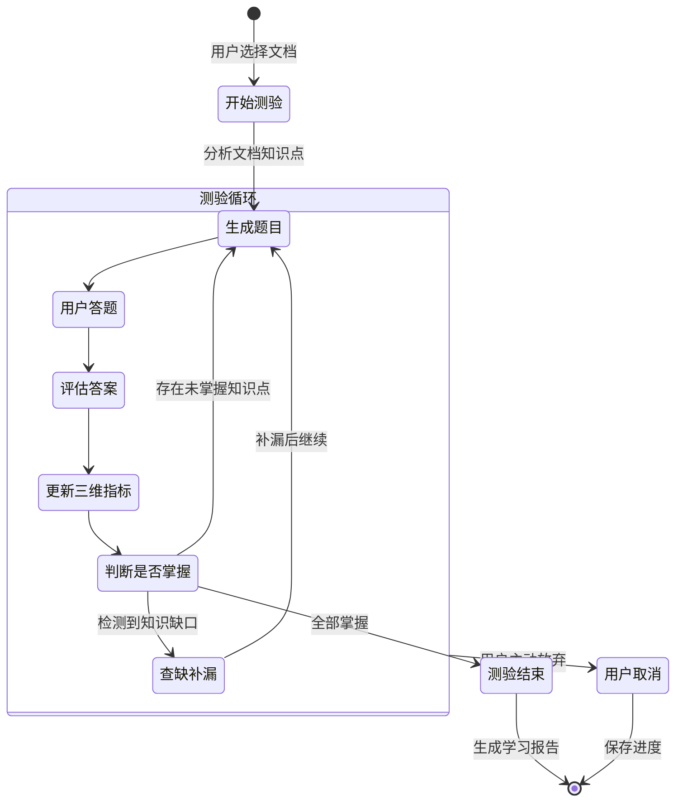

# 项目需求文档 - 智能测验系统

## 1. 项目概述

实现一个基于 **ReAct Agent** 的智能测验系统。当用户选择特定文档/知识库后开始测验,**系统会持续出题直到用户完全掌握这些文档**,形成"测验 → 认知分析 → 查缺补漏 → 再测验"的闭环,除非用户主动取消。

## 2. 核心目标

### 2.1 "吃透"原则
- **不设固定题目数量**: 题目数量由用户掌握程度决定
- **持续查缺补漏**: 错误的知识点会被重复测试,直到掌握
- **主动结束**: 只有当所有知识点达标 或 用户主动取消时才结束

### 2.2 结束条件
测验在以下情况结束:
1. ✅ **全部掌握**: 三维指标均达标且无未解决的知识缺口
2. ❌ **用户取消**: 用户主动放弃测验

---

## 3. 三维认知模型

### 3.1 维度定义

| 维度 | 含义 | 计量方式 | 达标阈值 |
|:---|:---|:---|:---|
| **理解深度 (D)** | 是否理解概念本质 | 解释题得分 + 关联题得分 | ≥ 70 |
| **认知负荷 (L)** | 答题是否吃力 | 响应时间 + 犹豫标记 | ≤ 40 |
| **稳定性 (S)** | 是否反复犯同类错误 | 同概念错误重复率 | ≥ 70 |

### 3.2 计量公式

> ⚠️ **注意**: 以下权重均为**初始估计值**,需要在实际部署后根据用户数据进行调优。
> 
> **TODO**: 
> - [ ] 上线后收集用户学习数据
> - [ ] 进行 A/B 测试对比不同权重组合
> - [ ] 根据学习效果反馈调整权重
> - [ ] 考虑引入机器学习自动优化权重

#### 理解深度 (Understanding Depth) - 0~100
```
D = w1 * 选择题正确率 + w2 * 解释题质量分 + w3 * 关联推理分

初始权重 (可配置):
- w1 = 0.3 (选择题权重) ⚠️ 待优化
- w2 = 0.4 (解释题权重) ⚠️ 待优化
- w3 = 0.3 (关联推理权重) ⚠️ 待优化

评估维度:
- 能否说出"为什么"
- 能否识别概念边界
- 能否举出反例
```

#### 认知负荷 (Cognitive Load) - 0~100 (越低越好)
```
L = w1 * 响应时间系数 + w2 * 犹豫系数 + w3 * 放弃率

初始权重 (可配置):
- w1 = 0.5 (响应时间权重) ⚠️ 待优化
- w2 = 0.3 (犹豫系数权重) ⚠️ 待优化
- w3 = 0.2 (放弃率权重) ⚠️ 待优化

其中:
- 响应时间系数 = min(100, (实际时间 / 平均时间) * 50)
- 犹豫系数 = 明确说"不知道"/"不确定" 次数 * 10
- 放弃率 = 跳过题目数 / 总题目数 * 100

判断标准:
- L < 30: 轻松 → 可以增加难度
- L 30-60: 正常
- L > 60: 吃力 → 需要降低难度或切换讲解模式
```

#### 稳定性 (Stability) - 0~100
```
S = 100 - (重复错误数 / 同概念总测试数) * 100

判断标准:
- S < 50: 不稳定,同一知识点反复出错 → 需要重点补漏
- S 50-80: 一般
- S > 80: 稳定,已掌握
```

### 3.3 题目数量动态调整

```
题目生成策略 = f(D, L, S, 未掌握知识点数)

规则:
1. 当存在 S < 50 的知识点时:
   → 优先针对该知识点出题,每个知识点至少 2 题

2. 当 L > 60 时:
   → 减少题量,每轮最多 3 题
   → 降低难度
   → 可能切换到讲解模式

3. 当 D < 50 且 L < 40 时:
   → 增加解释类题目
   → 提高难度

4. 当 D ≥ 70 且 L ≤ 40 且 S ≥ 70 时:
   → 该知识点标记为"已掌握"
   → 如果所有知识点都已掌握,测验结束
```

---

## 4. Agent 提示词设计

### 4.1 题目生成提示词

```
你是一个智能测验助手,负责根据用户的知识库文档生成多元化的测验题目。

## 当前用户状态
- 理解深度 (D): {understanding_depth}/100
- 认知负荷 (L): {cognitive_load}/100 (越低越好)
- 稳定性 (S): {stability}/100
- 未掌握知识点: {unmastered_concepts}

## 可用题型
1. **客观题** (可自动评分):
   - SINGLE_CHOICE: 单选题 - 从多选项中选一个
   - MULTIPLE_SELECT: 多选题 - 从多选项中选多个
   - TRUE_FALSE: 判断题 - 判断对错
   - FILL_IN_BLANK: 填空题 - 填写空白处
   - ORDERING: 排序题 - 按正确顺序排列
   - MATCHING: 连线题 - 左右配对

2. **主观题** (AI 评分):
   - SHORT_ANSWER: 简答题 - 简短回答
   - EXPLANATION: 解释题 - 解释原因/原理
   - CODE_COMPLETION: 代码补全 - 补全代码片段

## 题型选择规则
1. **认知负荷高 (L > 60)**:
   - 优先使用: 判断题、单选题
   - 避免使用: 排序题、连线题、主观题
   
2. **认知负荷正常 (L 30-60)**:
   - 混合使用: 单选、多选、填空、简答
   
3. **认知负荷低 (L < 30)**:
   - 可以使用: 解释题、代码补全、排序题
   - 提高难度以挑战用户
   
4. **理解深度低 (D < 50)**:
   - 多出解释题和填空题,考查概念理解

5. **稳定性低 (S < 50)**:
   - 针对薄弱知识点,混合多种题型反复测试

## 知识库内容
{document_chunks}

## 输出格式
请生成 {question_count} 道题目,JSON 格式:
{
  "questions": [
    {
      "type": "SINGLE_CHOICE",
      "text": "以下哪个不是Java的基本数据类型?",
      "options": ["int", "String", "double", "boolean"],
      "correct_answer": "String",
      "related_concept": "Java基本数据类型",
      "difficulty": "EASY",
      "explanation": "String是引用类型,不是基本数据类型"
    },
    {
      "type": "MULTIPLE_SELECT",
      "text": "以下哪些是面向对象的特性? (多选)",
      "options": ["封装", "继承", "多态", "递归"],
      "correct_answer": "封装,继承,多态",
      "related_concept": "面向对象特性",
      "difficulty": "MEDIUM",
      "explanation": "封装、继承、多态是面向对象三大特性,递归是编程技术"
    },
    {
      "type": "TRUE_FALSE",
      "text": "Java中所有的类都直接或间接继承自Object类",
      "options": null,
      "correct_answer": "TRUE",
      "related_concept": "Java继承体系",
      "difficulty": "EASY",
      "explanation": "Object是Java所有类的根类"
    },
    {
      "type": "FILL_IN_BLANK",
      "text": "在Java中,使用____关键字来定义常量",
      "options": null,
      "correct_answer": "final|Final|FINAL",
      "related_concept": "Java常量定义",
      "difficulty": "EASY",
      "explanation": "final关键字用于定义常量"
    },
    {
      "type": "ORDERING",
      "text": "请将Java程序的执行顺序排列正确",
      "options": ["运行", "编译", "编写源代码", "加载类文件"],
      "correct_answer": "3,2,4,1",
      "related_concept": "Java程序执行流程",
      "difficulty": "MEDIUM",
      "explanation": "正确顺序: 编写源代码 -> 编译 -> 加载类文件 -> 运行"
    },
    {
      "type": "EXPLANATION",
      "text": "请解释Java中重载(Overload)和重写(Override)的区别",
      "options": null,
      "correct_answer": "重载是同一类中方法名相同但参数不同;重写是子类重新实现父类方法",
      "related_concept": "方法重载与重写",
      "difficulty": "HARD",
      "explanation": "重载发生在编译时,重写发生在运行时"
    }
  ]
}
```


### 4.2 答案评估提示词

```
你是一个智能评估助手,负责评估用户的答案并分析其认知状态。

## 题目信息
- 题目: {question_text}
- 类型: {question_type}
- 正确答案: {correct_answer}
- 关联知识点: {related_concept}

## 用户回答
- 答案: {user_answer}
- 响应时间: {response_time_ms} 毫秒
- 平均响应时间: {avg_response_time_ms} 毫秒

## 评估任务
请评估用户的回答,并输出 JSON 格式:
{
  "is_correct": true/false,
  "score": 0-100,  // 部分正确的情况
  "understanding_analysis": {
    "knows_what": true/false,      // 知道"是什么"
    "knows_why": true/false,       // 知道"为什么"
    "knows_boundary": true/false,  // 知道边界/限制
    "depth_score": 0-100
  },
  "cognitive_load_signals": {
    "hesitation_detected": true/false,  // 是否有犹豫表达
    "confusion_detected": true/false,   // 是否有困惑表达
    "load_score": 0-100
  },
  "feedback": "给用户的反馈,鼓励性语言",
  "concept_mastery": "MASTERED | PARTIAL | UNMASTERED"
}
```

### 4.3 查缺补漏提示词

```
你是一个知识缺口分析助手,负责分析用户的错误并生成补救内容。

## 错误记录
用户在以下知识点上出现了错误:
{error_records}

## 分析任务
请分析用户的知识缺口,并输出 JSON 格式:
{
  "gap_analysis": {
    "concept": "知识点名称",
    "gap_type": "CONCEPTUAL | PROCEDURAL | BOUNDARY",
    "description": "具体缺失了什么,如'混淆了抽象类和接口的区别'",
    "root_cause": "可能的根本原因",
    "severity": "HIGH | MEDIUM | LOW"
  },
  "remediation": {
    "explanation": "简洁的知识点讲解 (200字以内)",
    "key_points": ["要点1", "要点2", "要点3"],
    "example": "一个帮助理解的例子",
    "follow_up_question": "一道验证是否理解的简单题目"
  }
}
```

### 4.4 测验结束判断提示词

```
你是一个学习进度评估助手,负责判断用户是否已经"吃透"所选文档。

## 用户当前状态
- 理解深度总分 (D): {understanding_depth}/100
- 认知负荷总分 (L): {cognitive_load}/100
- 稳定性总分 (S): {stability}/100
- 已测试知识点数: {tested_concepts_count}
- 已掌握知识点数: {mastered_concepts_count}
- 未掌握知识点: {unmastered_concepts}
- 总题目数: {total_questions}
- 正确率: {accuracy}%

## 结束条件
1. 所有知识点的稳定性 S ≥ 70
2. 整体理解深度 D ≥ 70
3. 认知负荷 L ≤ 40 (证明已经轻松掌握)

## 判断任务
请判断是否可以结束测验:
{
  "can_finish": true/false,
  "reason": "判断理由",
  "remaining_gaps": ["还需要加强的知识点"],
  "next_action": "CONTINUE | FINISH | REMEDIATE",
  "summary": "对用户学习情况的总结性评价"
}
```

---

## 5. 业务流程

### 5.1 测验主流程



### 5.2 单轮答题流程

```
1. 根据当前三维指标决定:
   - 题目数量 (1-5题)
   - 题目难度
   - 题目类型

2. 用户完成本轮答题

3. 评估每道题:
   - 判断对错
   - 分析理解深度
   - 检测认知负荷信号

4. 更新三维指标

5. 决定下一步:
   - 继续出题
   - 进入补漏讲解
   - 结束测验
```

---

## 6. 技术选型

*   **框架**: Spring Boot 3.4.4
*   **AI 集成**: Spring AI Alibaba (DashScope/通义千问)
*   **数据库**: PostgreSQL (关系型 + 向量数据)
*   **向量库**: PostgreSQL + pgvector
*   **缓存**: Caffeine
*   **Agent 模式**: ReAct (Reasoning and Acting)

---

## 7. 验收标准

### 7.1 功能验收
- ✅ 能够基于用户选择的文档生成测验
- ✅ 能够动态调整题目数量和难度
- ✅ 能够持续测试直到用户掌握或取消
- ✅ 能够识别并记录知识缺口
- ✅ 能够生成个性化分析报告

### 7.2 质量验收
- ✅ 三维认知模型计量合理
- ✅ Agent 决策符合预期
- ✅ 提示词输出稳定可解析
- ✅ 系统稳定性 >= 99%
